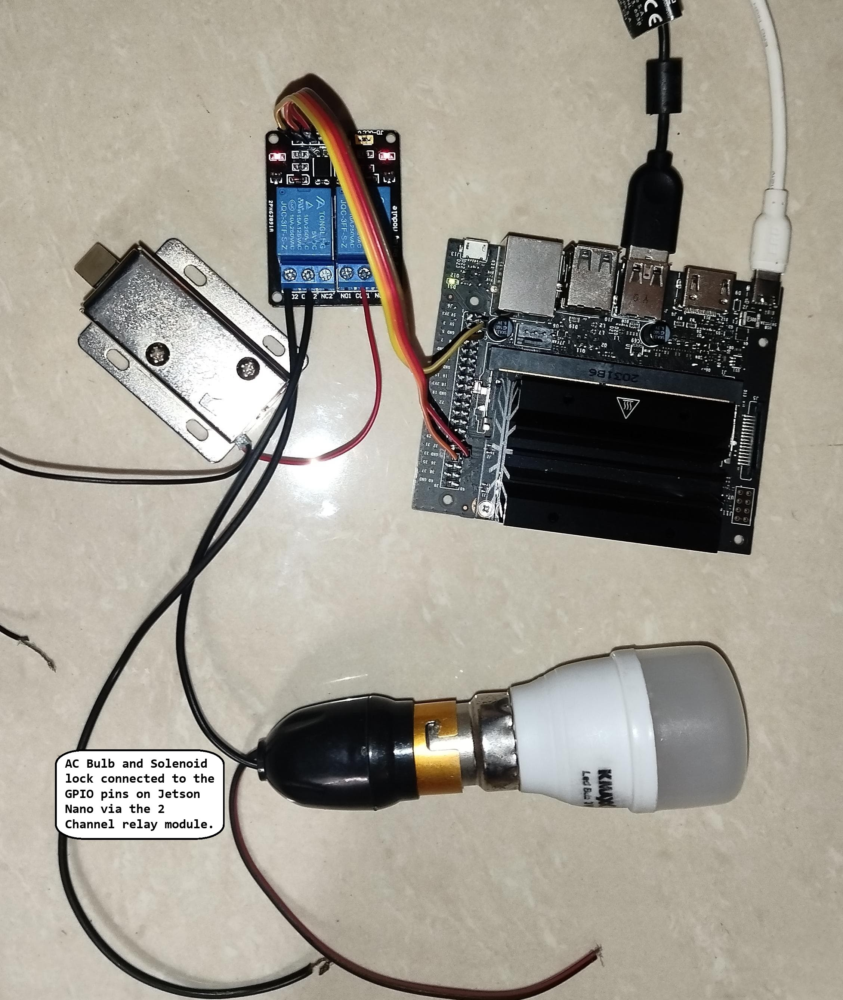
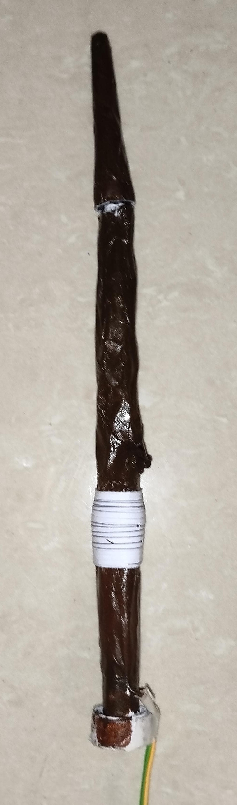

# ElderWand-JetsonNano

ElderWand-JetsonNano is a sophisticated machine learning project optimized for the NVIDIA Jetson Nano platform. The project harnesses the power of CUDA-accelerated OpenCV to enable real-time gesture recognition via a connected USB camera, driving external hardware components like relays and servos through GPIO pins. By utilizing a wand equipped with an LED or retroreflective marker, this system can interpret specific gestures to trigger actions, such as controlling lighting or unlocking a solenoid lock. The project serves as a compelling demonstration of Jetson Nano’s capabilities in AI, computer vision, and embedded systems—an ideal submission for the Jetson AI Ambassador Program.

## Project Structure

```
ElderWand-JetsonNano/
├── venv/                # Python virtual environment directory
├── ACLO_rf.pkl          # Pre-trained Random Forest model for ACLO gesture
├── ACNO_rf.pkl          # Pre-trained Random Forest model for ACNO gesture
├── ACPN_rf.pkl          # Pre-trained Random Forest model for ACPN gesture
├── LICENSE              # License file
├── NPAC_rf.pkl          # Pre-trained Random Forest model for NPAC gesture
├── main.py              # Core script handling camera input, gesture recognition, and GPIO control
├── predict.py           # Prediction script using trained models
├── train.py             # Model training script for gesture recognition
```

## Features and Capabilities

### 1. **Real-Time Computer Vision with CUDA**
   Leveraging the Jetson Nano’s GPU-accelerated OpenCV with CUDA, the project can process video frames in real time, enabling rapid recognition of wand movements. The USB camera captures high-resolution images, which are processed on-the-fly for gesture identification and triggering actions with minimal latency.

### 2. **Advanced Gesture Recognition**
   The system employs pre-trained Random Forest models to classify wand gestures based on captured keypoint data. These gestures correspond to specific actions, such as:
   - **Lumos ('L')**: Turns on a light (via relay).
   - **Nox ('N')**: Turns off the light.
   - **Alohomora ('A')**: Unlocks a solenoid lock for 1.5 seconds.

   The input data is preprocessed, applying Gaussian blur, thresholding, and contour detection to isolate the wand tip's movements. By tracking the position of the wand’s tip, the system can map the trajectory and classify it as a specific gesture.

### 3. **GPIO-Controlled Automation**
   Jetson Nano’s GPIO pins are programmed to control external devices such as relays and servos. When a gesture is recognized, the corresponding GPIO pin is triggered:
   - **Servo Control**: The solenoid lock is connected to a servo controlled by the Jetson Nano, unlocking for a defined duration.
   - **Relay Control**: The lighting system (simulating Lumos and Nox spells) is controlled via relays, powered by the Jetson Nano’s GPIO interface.

### 4. **Pre-Trained Models**
   Gesture recognition is powered by Random Forest classifiers, trained on pre-processed gesture data and saved as `.pkl` files. These models enable fast and accurate predictions when integrated into the main application, ensuring high responsiveness during gesture detection.

## Detailed Workflow

### Hardware Setup

1. **Jetson Nano**: Central processing unit for running the machine learning models and controlling GPIO pins.
2. **USB Camera**: Captures live video feed for real-time gesture recognition.
3. **Relays**: External devices connected via GPIO, controlling lighting and solenoid locks.
4. **Servo Motors**: Connected to the solenoid lock, allowing the system to physically unlock based on gesture input.
5. **Wand**: It can be a simple stick with reflective tape or an LED at its tip.

<p align="center">
 
</p>

```
SERVO_PIN = 33  # Change this to the GPIO pin connected to the servo
GPIO_PIN_LUMOS = 32  # GPIO pin for Lumos
```
### Image Processing Pipeline

Once the `main.py` script is executed, the system initializes the camera and begins capturing frames. The frames are processed using the following steps:

1. **Frame Capture and Preprocessing**:
   - The camera captures a live video stream, which is resized and converted into grayscale for better blob detection performance.
   - Gaussian blur and binary thresholding are applied to isolate the wand’s LED or reflective tip.

2. **Keypoint Detection**:
   - Using OpenCV’s `SimpleBlobDetector`, the wand’s tip is detected and tracked across frames. Parameters such as color, area, and circularity are fine-tuned for accurate detection of the wand marker.

3. **Gesture Path Recognition**:
   - The system monitors the trajectory of the wand’s tip from the start point to the end point. If the gesture matches predefined paths, such as an ‘L’ or ‘A’, the corresponding action is triggered (e.g., turning on a light or unlocking a door).
   - This is further refined by mapping keypoints and drawing lines between consecutive points to form a recognizable shape.

4. **Gesture Prediction**:
   - Once the gesture is fully traced, the frame is processed by the `predict.py` script, which uses the pre-trained Random Forest model to classify the gesture. Based on the output, the appropriate GPIO action is executed (light on/off or lock control).

You're right! Since the Jetson Nano runs JetPack, which is based on Ubuntu, the setup instructions should be focused on Linux/Ubuntu environments. Let's update that section to reflect that. Here’s the corrected version:

---

## Getting Started

### Prerequisites

Before running the project, make sure you have Jetson Nano set up with JetPack (which includes support for CUDA, cuDNN, TensorRT, and other libraries necessary for machine learning and computer vision tasks). Ensure you have OpenCV compiled with CUDA support for optimal performance.

You can install the necessary Python dependencies with the following command:

```bash
pip install scikit-learn pandas joblib numpy pillow opencv-python Jetson.GPIO
```

### Virtual Environment Setup

1. **Create a virtual environment**:
    ```bash
    python3 -m venv venv
    ```

2. **Activate the environment**:
    ```bash
    source venv/bin/activate
    ```

3. **Install the required dependencies**:
    ```bash
    pip install -r requirements.txt
    ```

### Running the Project

#### Model Training

To train the gesture recognition models, use the `train.py` script:

```bash
python train.py
```

#### Gesture Prediction

To predict and trigger actions based on wand gestures, run the `predict.py` script:

```bash
python predict.py
```

#### Main Application Execution

To execute the full application, including real-time video processing, gesture recognition, and GPIO control, run:

```bash
python main.py
```
Upon execution, the system will start capturing live video, allowing you to trace gestures with your wand. For instance, tracing an 'L' shape will activate the light (Lumos), and tracing an 'A' shape will unlock the solenoid lock (Alohomora).

---

## Technical Specifications

- **OpenCV CUDA**: The project relies on OpenCV compiled with CUDA support, enabling GPU acceleration on the Jetson Nano. This significantly speeds up tasks such as frame capture, blob detection, and image preprocessing.
- **Gesture Detection**: The system uses blob detection parameters to filter keypoints based on properties like color, area, and circularity, ensuring robust gesture tracking in real-world conditions.
- **GPIO Handling**: The Jetson.GPIO library is used for interfacing with external devices through the Jetson Nano’s GPIO pins, enabling real-world interaction based on AI predictions.

### Future Enhancements

- **Expanded Gesture Library**: Future iterations may include additional gestures and control mechanisms, integrating more complex AI models for enhanced accuracy.
- **IoT Integration**: Expanding the project to include remote monitoring and control via IoT could further showcase the system’s capabilities in real-world automation scenarios.

## Acknowledgements

Special thanks to the developers and contributors of the libraries used in this project:
- `scikit-learn`
- `pandas`
- `joblib`
- `numpy`
- `pillow`
- `opencv-python`
- `Jetson.GPIO`

## Contributing

Contributions are welcome! You can submit issues and pull requests through the [GitHub repository](https://github.com/Jjateen/ElderWand-JetsonNano).

---

For a demo, check out the [video](https://drive.google.com/file/d/1CB1uXlzaIKtvNENYo6e2GBvyCuiSXDgl/view?usp=drivesdk).

---

Thank you for exploring ElderWand-JetsonNano!
